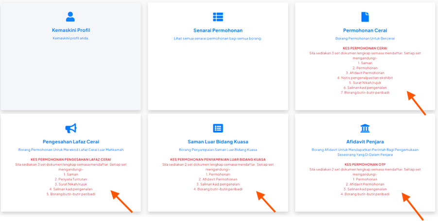
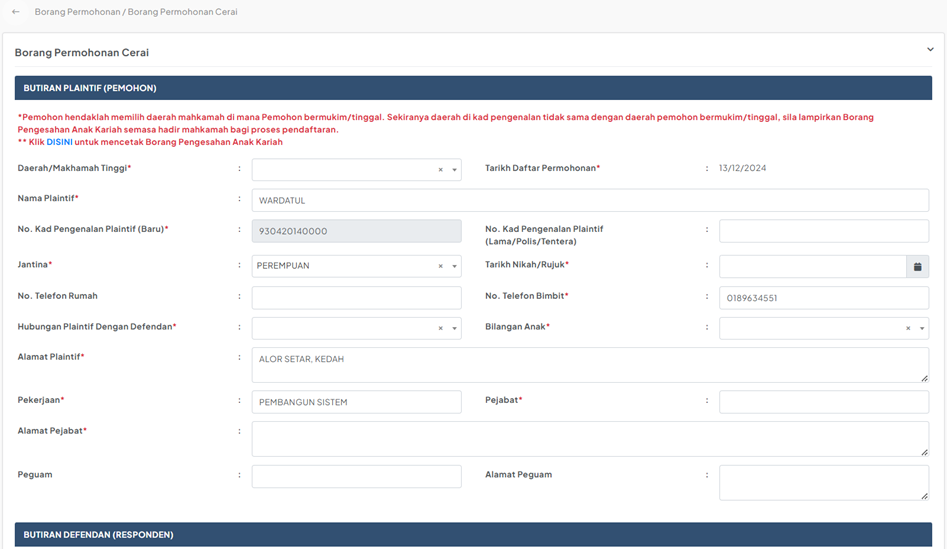

# Panduan Mengisi Borang Permohonan

::: info Tujuan
Membantu pengguna untuk memilih jenis permohonan dan mengisi borang permohonan dalam sistem MyReCourt.
:::

## Jenis-jenis Permohonan

Sistem MyReCourt menyediakan empat jenis permohonan:

1. **Permohonan Cerai**
   - Borang Permohonan Untuk Bercerai
   - Keperluan: 3 set dokumen lengkap
   - Dokumen diperlukan:
     - Saman
     - Permohonan
     - Afidavit Permohonan
     - Nota pengenalpastian eksibit
     - Surat Nikah/rujuk
     - Salinan kad pengenalan
     - Borang butir-butir peribadi

2. **Pengesahan Lafaz Cerai**
   - Borang Permohonan Untuk Mensabitkan Lafaz Cerai Luar Mahkamah
   - Keperluan: 3 set dokumen lengkap
   - Dokumen diperlukan:
     - Saman
     - Penyata Tuntutan
     - Surat Nikah/rujuk
     - Salinan kad pengenalan
     - Borang butir-butir peribadi

3. **Saman Luar Bidang Kuasa**
   - Borang Penyampaian Saman Luar Bidang Kuasa
   - Keperluan: 2 set dokumen lengkap
   - Dokumen diperlukan:
     - Saman
     - Permohonan
     - Afidavit Permohonan
     - Borang butir-butir peribadi

4. **Affidavit Penjara**
   - Borang Affidavit Untuk Mendapatkan Perintah Bagi Pengemukaan Seseorang Yang Di Dalam Penjara
   - Keperluan: 2 set dokumen lengkap
   - Dokumen diperlukan:
     - Permohonan
     - Afidavit Permohonan
     - Salinan kad pengenalan
     - Borang butir-butir peribadi

## Langkah-langkah Mengisi Borang

### 1. Pilih Jenis Permohonan

::: tip Langkah 1
1. Log masuk ke dalam sistem MyReCourt
2. Pada paparan Dashboard, pilih salah satu kad permohonan yang ingin dibuat
3. Klik pada kad tersebut untuk memulakan pengisian borang
:::

### 2. Isi Borang Permohonan

::: tip Langkah 2
1. Sistem akan memaparkan borang permohonan yang dipilih
2. Maklumat dari profil anda akan diisi secara automatik:
   - Nama Plaintif
   - No. Kad Pengenalan
   - Jantina
   - Alamat
   - Pekerjaan
   - Maklumat perhubungan
3. Isi semua medan yang bertanda merah (*) kerana ia adalah medan wajib
:::

### 3. Simpan dan Hantar Permohonan

::: tip Langkah 3
Terdapat dua pilihan setelah mengisi borang:

1. Klik butang  untuk:
   - Menyimpan maklumat borang
   - Kembali ke paparan Senarai Permohonan
   - Boleh dikemaskini kemudian

2. Klik butang  untuk:
   - Menyimpan maklumat borang
   - Terus ke proses pembayaran
   - Hantar borang ke Admin Daerah
:::

::: warning Nota Penting
- Pastikan semua maklumat yang diisi adalah tepat dan lengkap
- Sediakan semua dokumen yang diperlukan mengikut jenis permohonan
- Permohonan yang tidak lengkap tidak akan diproses
- Simpan nombor rujukan permohonan untuk semakan status
::: 