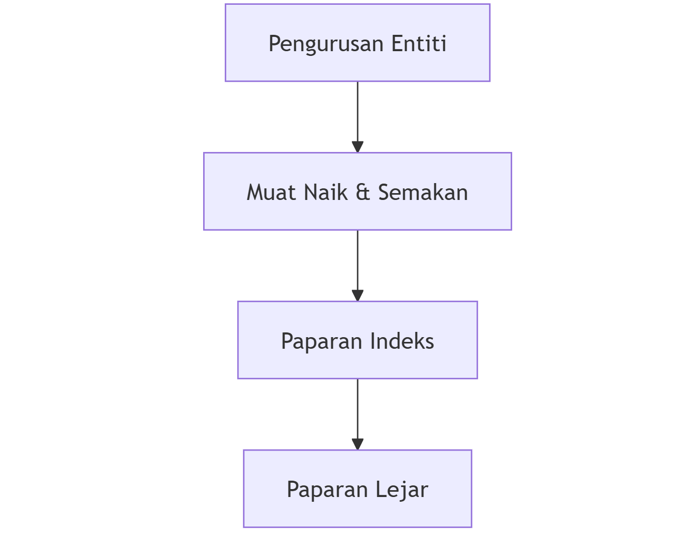

## Carta Aliran Pengguna (User Flow)

Berikut adalah aliran halaman yang akan dialami oleh pengguna:

1. **Pengurusan Entiti**
   - Pengguna akan memulakan proses dengan mengurus maklumat dan tetapan entiti mereka. Ini termasuk menambah atau mengemaskini maklumat asas entiti seperti nama, alamat, dan maklumat hubungan.

2. **Muat Naik & Semakan**
   - Selepas mengurus entiti, pengguna akan memuat naik dokumen yang diperlukan. Sistem akan menyemak dan memproses dokumen yang dimuat naik untuk memastikan kesahihan dan kelengkapan.

3. **Paparan Indeks**
   - Setelah dokumen disemak, pengguna boleh melihat paparan indeks yang memberikan gambaran menyeluruh tentang prestasi kewangan dan operasi entiti mereka.

4. **Paparan Lejar**
   - Akhir sekali, pengguna boleh mengakses paparan lejar yang menunjukkan maklumat kewangan terperinci dalam format lejar standard. Paparan ini membolehkan pengguna menganalisis dan mengurus data kewangan dengan lebih efisien.

Aliran ini direka untuk memastikan pengalaman pengguna yang lancar dan teratur, bermula dari pengurusan entiti sehingga ke analisis kewangan terperinci.

::: tip Nota Penting
Setiap proses dalam sistem PRIDIK direka untuk memastikan:
- Ketepatan data yang dimasukkan
- Kecekapan dalam pemprosesan
- Pengesanan awal sebarang isu
- Kemudahan dalam semakan dan pembetulan
:::