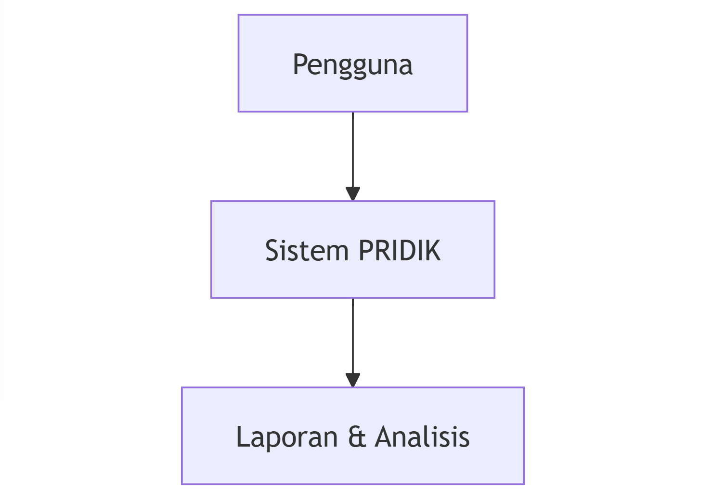
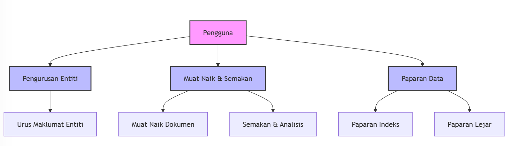
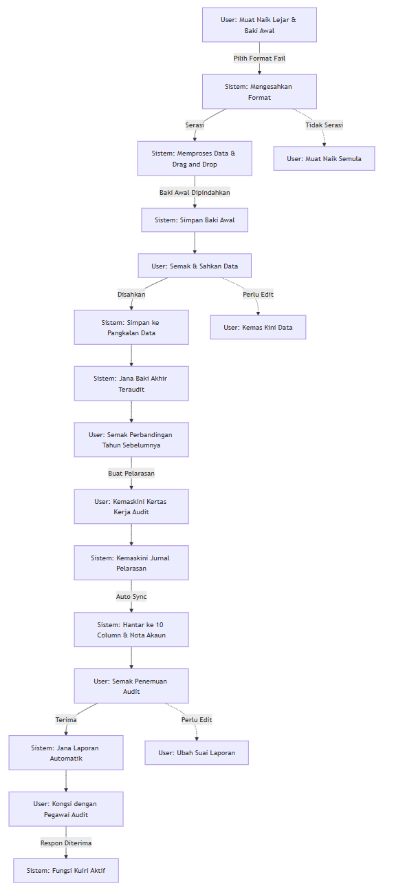
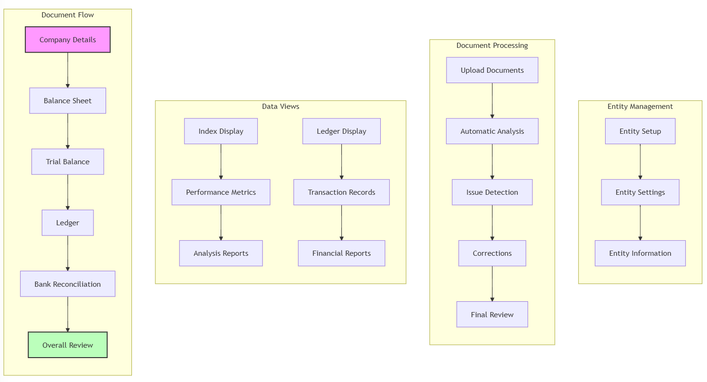

# Carta Alir Sistem PRIDIK

::: info Pengenalan
Manual ini menerangkan aliran kerja sistem PRIDIK secara menyeluruh, dari peringkat tinggi hingga ke proses terperinci.
:::

## 1. Gambaran Keseluruhan Sistem (Level 0)

Pada tahap tertinggi, PRIDIK merupakan sistem yang memproses input daripada pengguna dan menghasilkan output dalam bentuk laporan dan analisis.

---

## 2. Komponen Utama Sistem (Level 1)

Sistem PRIDIK terbahagi kepada tiga komponen utama yang saling berkaitan:

### 2.1 Pengurusan Entiti
- Menguruskan maklumat organisasi
- Mengawal tetapan dan konfigurasi sistem

### 2.2 Muat Naik & Semakan
- Fungsi muat naik dokumen
- Proses semakan automatik
- Sistem analisis

### 2.3 Paparan Data
- Paparan indeks untuk metrik prestasi
- Paparan lejar untuk data kewangan

---

## 3. Proses Terperinci Muat Naik dan Semakan (Level 2)

### 3.1 Permulaan Muat Naik
- Pengguna muat naik fail audit
- Sistem mengesahkan format fail
- Jika format tidak sesuai, pengguna perlu muat naik semula
- Jika format disahkan, sistem meneruskan pemprosesan

### 3.2 Pemprosesan dan Pengesahan Data
- Sistem memproses data melalui antara muka drag-and-drop
- Fail audit yang diproses akan disimpan
- Pengguna perlu menyemak dan mengesahkan data
- Terdapat dua laluan yang mungkin:
  - Jika data betul (Disahkan): Sistem menyimpan terus ke pangkalan data
  - Jika data perlu diperbaiki (Perlu Edit): Pengguna perlu menyemak semula data

### 3.3 Langkah-langkah Pemprosesan Akhir
- Sistem menyimpan fail audit akhir
- Pengguna boleh membuat perbandingan dengan data tahun sebelumnya
- Perancangan kerja dibuat
- Pengguna menyemak kertas kerja audit
- Sistem menjana catatan jurnal secara automatik
- Proses auto sync dilaksanakan
- Sistem mengemaskini 10 lajur dan nota akaun

---

## 4. Proses Terperinci Sistem (Level 2)

Setiap komponen utama mempunyai aliran proses yang terperinci:

### 4.1 Proses Pengurusan Entiti
- **Penetapan Entiti**: Proses awal mendaftar entiti baru
- **Tetapan Entiti**: Konfigurasi dan pengurusan tetapan
- **Maklumat Entiti**: Penyelenggaraan data organisasi

### 4.2 Proses Pemprosesan Dokumen
- **Antara Muka Muat Naik**: Sistem muat naik dokumen
- **Analisis Automatik**: Pemeriksaan dokumen secara automatik
- **Pengesanan Isu**: Mengenal pasti masalah atau kesilapan
- **Mekanisme Pembetulan**: Proses membetulkan kesilapan
- **Proses Semakan**: Pengesahan akhir dokumen

### 4.3 Sistem Paparan Data
- **Paparan Indeks**
  * Metrik prestasi
  * Laporan analisis
- **Paparan Lejar**
  * Rekod transaksi
  * Laporan kewangan

### 4.4 Aliran Dokumen
1. **Butiran Koperasi**: Input maklumat asas
2. **Kunci Kira-Kira**: Pemprosesan penyata kewangan
3. **Imbangan Duga**: Pengesahan baki akaun
4. **Lejar**: Pengurusan rekod transaksi
5. **Penyesuaian Bank**: Pengesahan transaksi bank
6. **Semakan Keseluruhan**: Penilaian akhir dokumen

::: tip Nota Penting
Setiap proses dalam sistem PRIDIK direka untuk memastikan:
- Ketepatan data yang dimasukkan
- Kecekapan dalam pemprosesan
- Pengesanan awal sebarang isu
- Kemudahan dalam semakan dan pembetulan
:::