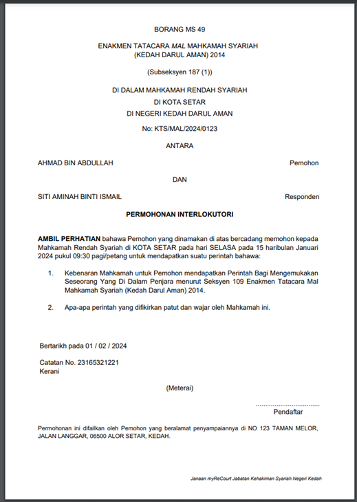

# Panduan Cetak Borang Permohonan

::: info Tujuan
Membantu pengguna untuk mencetak borang permohonan yang perlu dibawa ketika hadir ke mahkamah.
:::

## Langkah-langkah Mencetak Borang

### 1. Akses Senarai Permohonan

::: tip Langkah 1
1. Log masuk ke sistem MyReCourt
2. Klik pada menu "Senarai Permohonan" di sebelah kiri skrin
3. Sistem akan memaparkan senarai semua permohonan yang pernah dibuat oleh pengguna
:::

### 2. Cetak Borang Permohonan

::: tip Langkah 2
1. Cari permohonan yang ingin dicetak dalam senarai
2. Klik pada ikon Cetak PDF 
   - Ikon ini hanya akan muncul untuk permohonan yang telah dibayar dengan pilihan "Cetak Sendiri"
3. Sistem akan menjana fail PDF untuk borang permohonan
:::

### 3. Hasil Cetakan

::: tip Langkah 3
Borang yang dicetak akan mengandungi maklumat berikut:
- Nombor kes
- Maklumat pemohon dan responden
- Butiran permohonan
- Tarikh dan masa pendengaran (jika telah ditetapkan)
:::

::: warning Nota Penting
- Pastikan printer disambungkan dan berfungsi dengan baik sebelum mencetak
- Borang yang dicetak perlu dibawa semasa hadir ke mahkamah
- Simpan salinan digital borang sebagai rujukan
- Sekiranya terdapat masalah semasa mencetak, sila:
  1. Periksa sambungan printer
  2. Pastikan format PDF dapat dibuka
  3. Cuba muat turun dan cetak semula
  4. Hubungi pihak mahkamah jika masalah berterusan
::: 