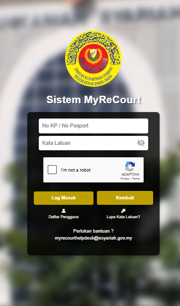
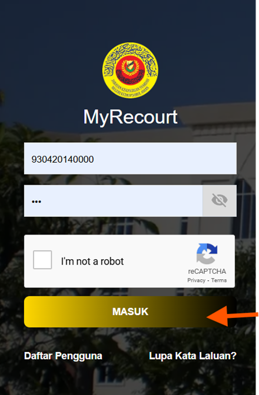

# Panduan Log Masuk

::: info Tujuan
Membantu pengguna untuk log masuk ke dalam sistem MyReCourt menggunakan ID pengguna dan kata laluan yang telah didaftarkan.
:::

## Langkah-langkah Log Masuk

### 1. Akses Sistem MyReCourt

::: tip Langkah 1
1. Buka pelayar web anda (contohnya Google Chrome)
2. Layari URL: [https://myrecourt.kedah.gov.my/login.php](https://myrecourt.kedah.gov.my/login.php)
3. Anda akan melihat paparan log masuk sistem
:::

### 2. Log Masuk ke Sistem

::: tip Langkah 2
1. Masukkan ID pengguna (nombor kad pengenalan) yang telah didaftarkan
2. Masukkan kata laluan anda
3. Tandakan kotak "I'm not a robot" untuk pengesahan reCAPTCHA
4. Klik butang **MASUK** untuk log masuk ke dalam sistem
:::

::: warning Nota Penting
- Pastikan ID pengguna dan kata laluan yang dimasukkan adalah betul
- Sekiranya anda terlupa kata laluan, klik pada pautan "Lupa Kata Laluan?"
- Jika anda belum mempunyai akaun, klik pada pautan "Daftar Pengguna" untuk mendaftar
::: 