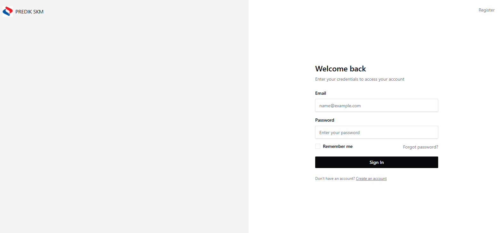

# Panduan Log Masuk Sistem PREDIK SKM

Berikut adalah panduan langkah demi langkah untuk log masuk ke sistem PREDIK SKM:

## Langkah-langkah Log Masuk

1. **Akses Laman Log Masuk**
   - Buka pelayar web anda (Chrome, Firefox, Edge, dll.)
   - Masukkan URL sistem PREDIK SKM ke dalam bar alamat
   - Tekan Enter untuk pergi ke laman log masuk

2. **Masukkan Maklumat Pengguna**
   - **Email**:
     - Masukkan alamat email yang telah didaftarkan dalam sistem
     - Email adalah berdasarkan peranan anda dalam sistem 
        (contoh: koperasi@skm.my / auditor@skm.my)
   
   - **Kata Laluan**:
     - Masukkan kata laluan abc123 bagi kedua dua email tersebut
     - Kata laluan adalah berdasarkan peranan anda dalam sistem
     - Pastikan huruf besar/kecil dimasukkan dengan betul

3. **Pilihan Tambahan**
   - Tandakan kotak "Remember me" jika anda ingin sistem mengingati maklumat log masuk anda
   - Ini berguna untuk komputer peribadi, tetapi tidak disyorkan untuk komputer awam

4. **Log Masuk**
   - Klik butang "Sign In" untuk memasuki sistem
   - Sistem akan mengesahkan maklumat anda dan membawa anda ke paparan utama jika maklumat adalah betul

5. **Jika Terlupa Kata Laluan**
   - Klik pautan "Forgot password?" di sebelah kanan bawah borang log masuk
   - Ikuti arahan untuk menetapkan semula kata laluan anda

6. **Pengguna Baharu**
   - Jika anda belum mempunyai akaun, klik pautan "Create an account" di bahagian bawah
   - Ikuti proses pendaftaran untuk membuat akaun baharu

## Nota Penting

- Pastikan anda log keluar selepas setiap sesi, terutamanya jika menggunakan komputer awam
- Jangan kongsi maklumat log masuk anda dengan orang lain
- Jika anda menghadapi masalah log masuk, hubungi pentadbir sistem untuk bantuan

