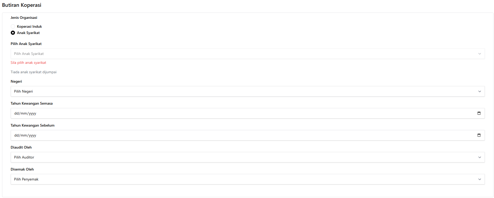

# Muat Naik Semakan

::: info Tujuan
Modul ini membolehkan anda memuat naik dan menyemak dokumen audit koperasi dengan sistematik mengikut langkah-langkah yang ditetapkan.
:::

## Langkah-langkah Muat Naik

Proses muat naik dan semakan dokumen terbahagi kepada 6 langkah utama:

1. Butiran Koperasi
2. Kunci Kira Kira
3. Imbangan Duga
4. Ledger
5. Bank Reconciliation
6. Overall Review

## Analisis Automatik Dokumen

Setiap kali dokumen dimuat naik, sistem akan menjalankan analisis automatik. Analisis ini akan menunjukkan:

#### Bahagian 1: Gambaran Keseluruhan Dokumen

Bahagian ini memaparkan hasil analisis automatik sistem terhadap dokumen yang dimuat naik. Terdapat dua bahagian utama:

1. **Senarai Isu yang Dikesan**
   - Setiap isu akan dikategorikan sama ada sebagai "Isu Utama" atau "Isu Kecil"
   - Setiap isu akan mempunyai:
      * Penerangan Isu: Huraian tentang masalah yang dikesan
      * Lokasi Isu: Di mana isu tersebut berlaku (contoh: baris atau figur tertentu)
      * Hasil Yang Dijangka: Apakah yang sepatutnya ada atau format yang betul

2. **Ringkasan Semakan**
   - **Isu Utama**: Bilangan isu kritikal yang perlu diselesaikan
   - **Isu Kecil**: Bilangan isu kecil yang disyorkan untuk diperbaiki
   - **Pembetulan Dokumen**: Bilangan pembetulan yang telah dibuat
   - **Bahagian Memerlukan Semakan**: Bilangan bahagian yang memerlukan perhatian

::: tip Cara Membaca Analisis
- Semak setiap isu yang disenaraikan
- Rujuk kepada lokasi yang dinyatakan dalam dokumen asal
- Buat pembetulan berdasarkan "Hasil Yang Dijangka"
- Muat naik semula dokumen setelah pembetulan dibuat
:::

## Langkah-langkah Terperinci

### 1. Butiran Koperasi

Pada langkah pertama, anda perlu mengisi maklumat asas koperasi:

- **Jenis Organisasi**: Pilih jenis organisasi (Dalam contoh ini, Anak Syarikat)
- **Pilih Anak Syarikat**: Pilih anak syarikat yang disenaraikan (dalam contoh ini, Syarikat A)
- **Negeri**: Pilih negeri di mana koperasi beroperasi
- **Tahun Kewangan Semasa**: Masukkan tahun kewangan semasa dalam format dd/mm/yyyy
- **Tahun Kewangan Sebelum**: Masukkan tahun kewangan sebelum dalam format dd/mm/yyyy
- **Diaudit Oleh**: Pilih nama juruaudit
- **Disemak Oleh**: Pilih nama penyemak

### 2. Kunci Kira Kira

Langkah ini memerlukan:
1. Muat naik fail Kunci Kira Kira
2. Muat naik fail rujukan yang berkaitan

Selepas muat naik, sistem akan menjalankan analisis terperinci dan memaparkan:

### 3. Imbangan Duga

Langkah ini memerlukan:
1. Muat naik fail Imbangan Duga (Berdasarkan Fail Contoh yang diberikan)
2. Muat naik fail rujukan yang berkaitan (Berdasarkan Fail Contoh yang diberikan)

Selepas muat naik, sistem akan menjalankan analisis ringkas yang menunjukkan:
- Status semakan dokumen
- Bilangan isu yang dikesan
- Cadangan pembetulan (jika ada)

### 4. Ledger

Langkah ini memerlukan:
1. Muat naik fail Ledger (Berdasarkan Fail Contoh yang diberikan)
2. Muat naik fail rujukan yang berkaitan (Berdasarkan Fail Contoh yang diberikan)

Selepas muat naik, sistem akan menjalankan analisis ringkas yang menunjukkan:
- Status semakan dokumen
- Bilangan isu yang dikesan
- Cadangan pembetulan (jika ada)

### 5. Bank Reconciliation

Langkah ini memerlukan:
1. Muat naik fail Bank Reconciliation (Berdasarkan Fail Contoh yang diberikan)
2. Muat naik fail rujukan yang berkaitan (Berdasarkan Fail Contoh yang diberikan)

Selepas muat naik, sistem akan menjalankan analisis ringkas yang menunjukkan:
- Status semakan dokumen
- Bilangan isu yang dikesan
- Cadangan pembetulan (jika ada)

### 6. Overall Review

Langkah terakhir ini memaparkan analisis menyeluruh untuk semua dokumen yang telah dimuat naik:

#### Paparan Analisis Keseluruhan
- Menggabungkan hasil analisis dari semua dokumen yang telah dimuat naik:
  * Kunci Kira Kira
  * Imbangan Duga
  * Ledger
  * Bank Reconciliation

#### Ciri-ciri Paparan
1. **Ringkasan Semua Isu**
   - Senarai isu dari setiap dokumen
   - Status isu (sama ada telah diselesaikan atau masih aktif)
   - Kategori isu (Utama/Kecil)

2. **Statistik Keseluruhan**
   - Jumlah isu yang dikesan
   - Jumlah pembetulan yang telah dibuat
   - Status semakan untuk setiap dokumen

::: warning Nota Penting
- Paparan ini adalah untuk **semakan sahaja**
- Tiada fungsi edit atau muat naik pada peringkat ini
- Sebarang pembetulan perlu dibuat dengan kembali ke langkah-langkah sebelumnya
:::

::: tip Nota
Setiap langkah 1 hingga 5 boleh diulang jika perlu membuat pembetulan. Walau bagaimanapun, langkah 6 (Overall Review) adalah muktamad dan tidak boleh diulang setelah disahkan.
:::

::: warning Peringatan
Setelah dokumen dimuat naik pada setiap langkah, sistem akan melakukan semakan automatik. Sila tunggu sehingga proses semakan selesai sebelum meneruskan ke langkah seterusnya.
:::
