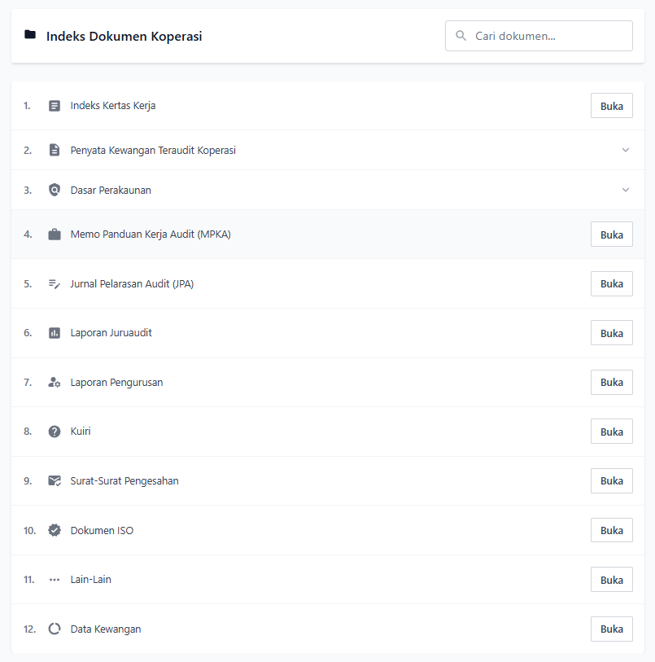

# Indeks Dokumen Koperasi

Halaman ini mengandungi senarai dokumen-dokumen penting berkaitan koperasi. Setiap dokumen boleh diakses dengan mengklik butang "Buka" pada sebelah kanan setiap item.

## Kandungan

1. **Indeks Kertas Kerja**  
   Dokumen yang mengandungi senarai kertas kerja koperasi.

2. **Penyata Kewangan Teraudit Koperasi**  
   Bahagian ini mengandungi pelbagai laporan kewangan:
   - **Kunci Kira-Kira**: Penyata kedudukan kewangan koperasi
   - **Akaun Pembahagian Keuntungan**: Laporan pembahagian keuntungan
   - **Akaun Untung Rugi**: Penyata prestasi kewangan
   - **Akaun Perdagangan**: Laporan aktiviti perdagangan
   - **Akaun Perkilangan**: Laporan aktiviti perkilangan
   - **Aliran Tunai**: Penyata aliran tunai koperasi

3. **Dasar Perakaunan**  
   Dokumen yang mengandungi dasar-dasar perakaunan koperasi.
   - **Nota Aset Tetap**: Maklumat terperinci mengenai aset tetap
   - **Nota Lain-Lain**: Nota-nota tambahan perakaunan

4. **Memo Panduan Kerja Audit (MPKA)**  
   Panduan kerja audit untuk koperasi.

5. **Jurnal Pelarasan Audit (JPA)**  
   Dokumen pelarasan audit.

6. **Laporan Juruaudit**  
   Laporan rasmi daripada juruaudit.

7. **Laporan Pengurusan**  
   Laporan mengenai pengurusan koperasi.

8. **Kuiri**  
   Senarai pertanyaan dan isu-isu audit.

9. **Surat-Surat Pengesahan**  
   Dokumen-dokumen pengesahan.

10. **Dokumen ISO**  
    Dokumen berkaitan piawaian ISO.

11. **Lain-Lain**  
    Dokumen-dokumen tambahan.

12. **Data Kewangan**  
    Data dan maklumat kewangan koperasi.

## Cara Penggunaan

1. Gunakan bar carian di bahagian atas untuk mencari dokumen tertentu.
2. Klik butang "Buka" untuk melihat dokumen yang dipilih.
3. Untuk dokumen dalam kategori yang boleh dikembangkan (contohnya Penyata Kewangan), klik pada kategori untuk melihat sub-dokumen.
