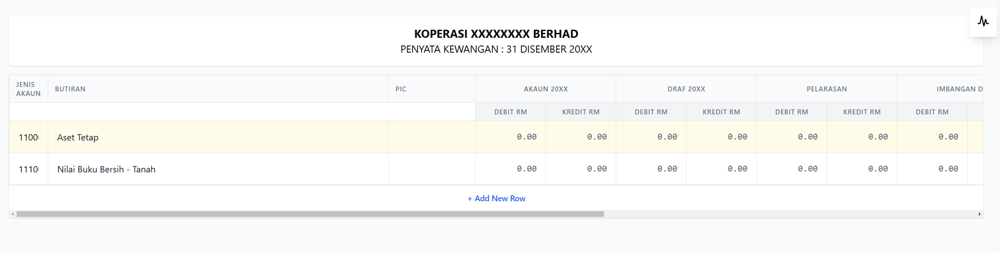
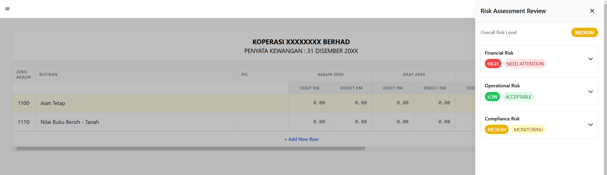
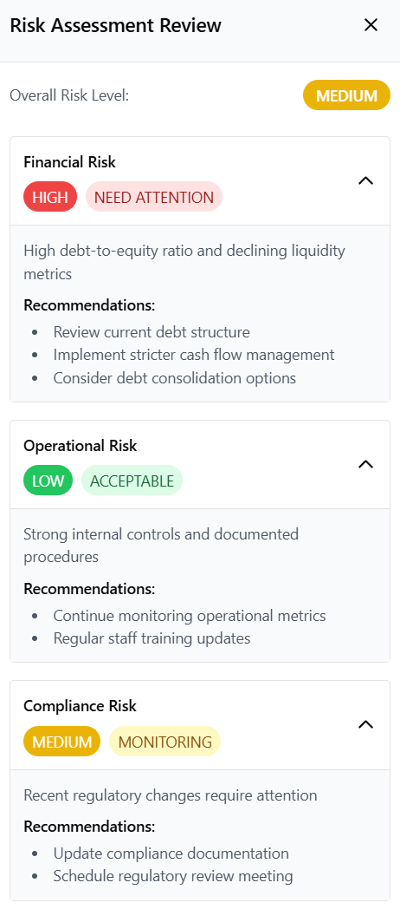

# Paparan Lejar ()

## Pemilihan Maklumat Koperasi

Sebelum melihat paparan lejar, sila pilih maklumat berikut:

### 1. Pilihan Koperasi

- Pilih nama koperasi dari senarai yang tersedia

### 2. Pilihan Penyata Kewangan

- Pilih jenis penyata kewangan yang ingin disemak

## Paparan Utama

Paparan Lejar berfungsi sebagai papan pemuka (dashboard) yang memaparkan maklumat kewangan koperasi secara tersusun dan komprehensif. Sistem ini mengintegrasikan data daripada pelbagai dokumen yang dimuat naik ke dalam format lejar yang standard.

## Ciri-ciri Utama

### 1. Paparan Lejar Automatik

- Sistem secara automatik mengklasifikasikan dan menyusun data dari dokumen yang dimuat naik
- Maklumat ditunjukkan dalam format lejar standard dengan nombor akaun dan butiran yang terperinci
- Paparan termasuk:
  - Aset Tetap
  - Nilai Buku Bersih
  - Debit dan Kredit untuk setiap kategori

### 2. Penilaian Risiko AI (Risk Assessment)

Sistem dilengkapi dengan ciri penilaian risiko AI yang boleh diakses melalui butang di sudut kanan atas. Penilaian ini memberikan analisis komprehensif secara masa nyata berdasarkan data kewangan terkini. Tahap risiko dan cadangan akan berubah secara dinamik mengikut perubahan dalam data kewangan koperasi.

> **Nota**: Paparan ini hanyalah contoh. Tahap risiko dan cadangan akan berbeza mengikut data sebenar koperasi anda.

#### Faktor-faktor Yang Mempengaruhi Penilaian Risiko

Sistem AI akan menilai risiko berdasarkan beberapa faktor utama:

1. **Risiko Kewangan**
   - Nisbah hutang kepada ekuiti
   - Metrik kecairan semasa
   - Aliran tunai
   - Prestasi aset
   - Trend pendapatan dan perbelanjaan

2. **Risiko Operasi**
   - Kecekapan operasi
   - Kawalan dalaman
   - Prosedur dokumentasi
   - Prestasi kakitangan
   - Penggunaan sumber

3. **Risiko Pematuhan**
   - Perubahan dalam peraturan
   - Status dokumentasi
   - Keperluan audit
   - Pematuhan kepada garis panduan koperasi

Setiap faktor ini akan dinilai secara berterusan dan tahap risiko akan dikemaskini secara automatik apabila:
- Data kewangan baharu dimuat naik
- Perubahan dalam trend kewangan dikesan
- Pengemaskinian dalam dokumentasi pematuhan
- Perubahan dalam metrik operasi

#### Risiko Kewangan (Financial Risk)
- **Tahap**: TINGGI (HIGH) - MEMERLUKAN PERHATIAN
- **Petunjuk**: Nisbah hutang kepada ekuiti yang tinggi dan metrik kecairan yang menurun
- **Cadangan**:
  - Semak semula struktur hutang semasa
  - Laksanakan pengurusan aliran tunai yang lebih ketat
  - Pertimbangkan pilihan penyatuan hutang

#### Risiko Operasi (Operational Risk)
- **Tahap**: RENDAH (LOW) - BOLEH DITERIMA
- **Petunjuk**: Kawalan dalaman yang kukuh dan prosedur yang didokumentasikan
- **Cadangan**:
  - Teruskan pemantauan metrik operasi
  - Kemaskini latihan kakitangan secara berkala

#### Risiko Pematuhan (Compliance Risk)
- **Tahap**: SEDERHANA (MEDIUM) - PEMANTAUAN
- **Petunjuk**: Perubahan peraturan terkini memerlukan perhatian
- **Cadangan**:
  - Kemaskini dokumentasi pematuhan
  - Jadualkan mesyuarat semakan peraturan

## Nota Penting

- Pastikan semua dokumen yang dimuat naik adalah tepat dan terkini
- Semak paparan lejar secara berkala untuk memantau prestasi kewangan
- Ambil perhatian terhadap sebarang penunjuk risiko yang tinggi
- Laksanakan cadangan yang diberikan dalam penilaian risiko untuk menambah baik prestasi koperasi
