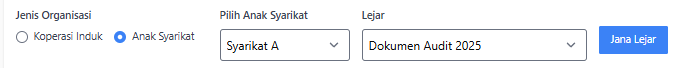
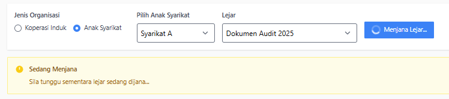
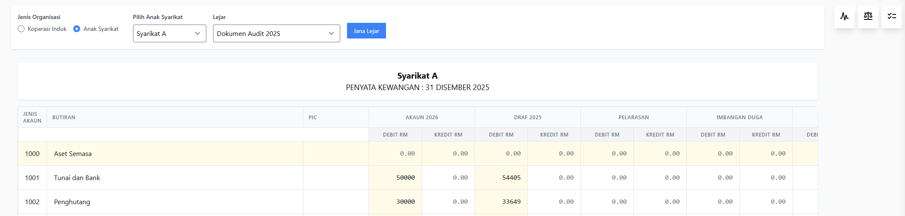
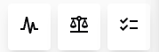
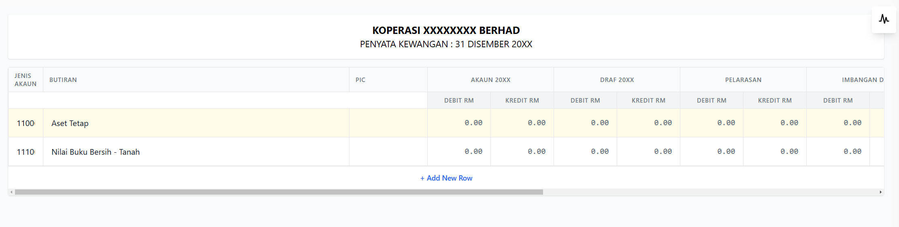
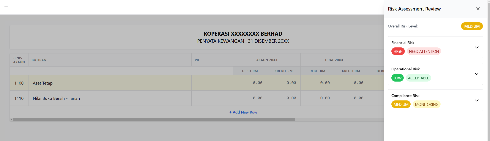
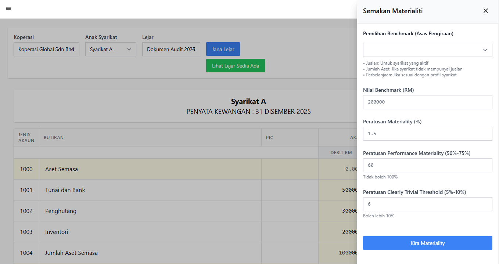
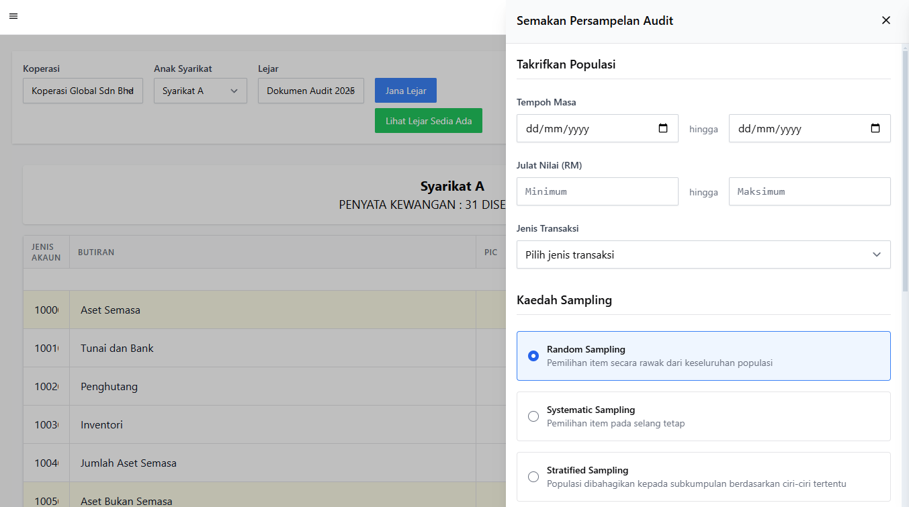
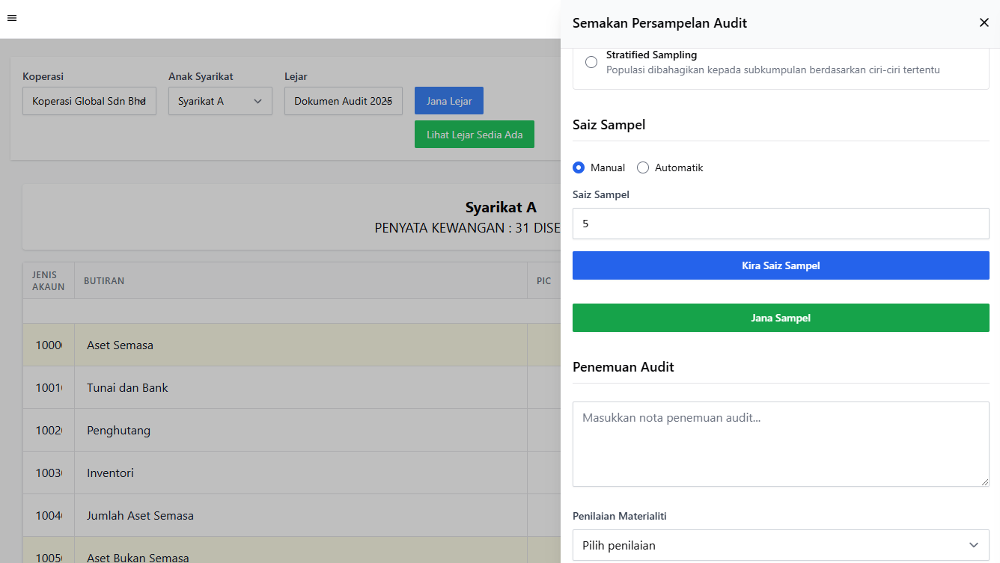

# Paparan Lejar (Ledger View)

Paparan Lejar berfungsi sebagai papan pemuka (dashboard) yang memaparkan maklumat kewangan koperasi secara tersusun dan komprehensif. Sistem ini mengintegrasikan data daripada pelbagai dokumen yang dimuat naik ke dalam format lejar yang standard.

::: tip Langkah-langkah

1. Pilih jenis organisasi
2. Pilih anak syarikat yang disenaraikan
3. Pilih Lejar yang terhasil daripada dokumen yang telah dimuat naik.
4. Klik pada butang "Jana Lejar" untuk menghasilkan lejar.
5. Penghasilan lejar mungkin mengambil sedikit masa. Sila tunggu sehingga lejar telah dihasilkan.

6. Lejar yang telah siap dijana akan ditunjukkan berdasarkan paparan di bawah.

7. Anda boleh click butang butang tersebut untuk mendapatkan penilaian risiko, semakan materialiti dan persampelan Audit oleh AI (Seperti yang ditulis di Ciri Ciri Utama).

:::

## Ciri-ciri Utama

### 1. Paparan Lejar Automatik

- Sistem secara automatik mengklasifikasikan dan menyusun data dari dokumen yang dimuat naik
- Maklumat ditunjukkan dalam format lejar standard dengan nombor akaun dan butiran yang terperinci
- Paparan termasuk:
  - Aset Tetap
  - Nilai Buku Bersih
  - Debit dan Kredit untuk setiap kategori

### 2. Penilaian Risiko AI (Risk Assessment)

Sistem dilengkapi dengan ciri penilaian risiko AI yang boleh diakses melalui butang di sudut kanan atas. Penilaian ini memberikan analisis komprehensif secara masa nyata berdasarkan data kewangan terkini. Tahap risiko dan cadangan akan berubah secara dinamik mengikut perubahan dalam data kewangan koperasi.

> **Nota**: Paparan ini hanyalah contoh. Tahap risiko dan cadangan akan berbeza mengikut data sebenar koperasi anda.

#### Faktor-faktor Yang Mempengaruhi Penilaian Risiko

Sistem AI akan menilai risiko berdasarkan beberapa faktor utama:

1. **Risiko Kewangan**
   - Nisbah hutang kepada ekuiti
   - Metrik kecairan semasa
   - Aliran tunai
   - Prestasi aset
   - Trend pendapatan dan perbelanjaan

2. **Risiko Operasi**
   - Kecekapan operasi
   - Kawalan dalaman
   - Prosedur dokumentasi
   - Prestasi kakitangan
   - Penggunaan sumber

3. **Risiko Pematuhan**
   - Perubahan dalam peraturan
   - Status dokumentasi
   - Keperluan audit
   - Pematuhan kepada garis panduan koperasi

Setiap faktor ini akan dinilai secara berterusan dan tahap risiko akan dikemaskini secara automatik apabila:
- Data kewangan baharu dimuat naik
- Perubahan dalam trend kewangan dikesan
- Pengemaskinian dalam dokumentasi pematuhan
- Perubahan dalam metrik operasi

#### Risiko Kewangan (Financial Risk)
- **Tahap**: TINGGI (HIGH) - MEMERLUKAN PERHATIAN
- **Petunjuk**: Nisbah hutang kepada ekuiti yang tinggi dan metrik kecairan yang menurun
- **Cadangan**:
  - Semak semula struktur hutang semasa
  - Laksanakan pengurusan aliran tunai yang lebih ketat
  - Pertimbangkan pilihan penyatuan hutang

#### Risiko Operasi (Operational Risk)
- **Tahap**: RENDAH (LOW) - BOLEH DITERIMA
- **Petunjuk**: Kawalan dalaman yang kukuh dan prosedur yang didokumentasikan
- **Cadangan**:
  - Teruskan pemantauan metrik operasi
  - Kemaskini latihan kakitangan secara berkala

#### Risiko Pematuhan (Compliance Risk)
- **Tahap**: SEDERHANA (MEDIUM) - PEMANTAUAN
- **Petunjuk**: Perubahan dalam peraturan terkini memerlukan perhatian
- **Cadangan**:
  - Kemaskini dokumentasi pematuhan
  - Jadualkan mesyuarat semakan peraturan

### 3. Semakan Materialiti (Materiality Check)

Sistem dilengkapi dengan ciri semakan materialiti yang boleh diakses melalui butang di sudut kanan atas. Semakan ini memberikan analisis komprehensif secara masa nyata berdasarkan data kewangan terkini.

#### Langkah-langkah Semakan Materialiti:

1. Klik pada butang "Semakan Materialiti" di bahagian atas paparan lejar.
2. Tetapkan parameter materialiti berikut:

   a. **Pemilihan Benchmark (Asas Pengiraan)**
      - Pilih benchmark yang sesuai dari senarai dropdown
      - Sistem akan memaparkan panduan:
        - Jualan: Untuk syarikat yang aktif
        - Jumlah Aset: Jika syarikat tidak mempunyai jualan
        - Perbelanjaan: Jika sesuai dengan profil syarikat

   b. **Nilai Benchmark (RM)**
      - Masukkan nilai benchmark dalam Ringgit Malaysia (contoh: 200,000)

   c. **Peratusan Materialiti (%)**
      - Masukkan peratusan materialiti (contoh: 1.5%)

   d. **Peratusan Performance Materiality (50%-75%)**
      - Masukkan nilai antara 50% hingga 75% (contoh: 60%)
      - Nota: Tidak boleh melebihi 100%

   e. **Peratusan Clearly Trivial Threshold (5%-10%)**
      - Masukkan nilai antara 5% hingga 10% (contoh: 6%)
      - Nota: Boleh melebihi 10% jika perlu

3. Klik butang "Kira Materialiti" untuk menghasilkan pengiraan materialiti berdasarkan parameter yang ditetapkan.

> **Nota**: Pengiraan materialiti akan berbeza mengikut data sebenar koperasi anda dan parameter yang dipilih.

### 4. Persampelan Audit (Audit Sampling)

Sistem dilengkapi dengan ciri persampelan audit yang boleh diakses melalui butang di sudut kanan atas. Persampelan ini membolehkan juruaudit memilih sampel transaksi untuk pemeriksaan audit secara sistematik.

#### Langkah-langkah Persampelan Audit:

1. Klik pada butang "Persampelan Audit" di bahagian atas paparan lejar.
2. Tetapkan parameter persampelan berikut:

   a. **Takrifkan Populasi**
      - Tentukan skop populasi yang akan diaudit

   b. **Tempoh Masa**
      - Pilih tarikh mula dan tarikh akhir untuk menentukan tempoh masa transaksi yang akan disampel
      - Gunakan format dd/mm/yyyy untuk kedua-dua tarikh

   c. **Julat Nilai (RM)**
      - Masukkan nilai minimum dan maksimum dalam Ringgit Malaysia untuk menapis transaksi berdasarkan nilai

   d. **Jenis Transaksi**
      - Pilih jenis transaksi yang ingin disampel dari senarai dropdown

   e. **Kaedah Sampling**
      - Pilih salah satu kaedah persampelan:
        - **Random Sampling**: Pemilihan item secara rawak dari keseluruhan populasi
        - **Systematic Sampling**: Pemilihan item pada selang tetap
        - **Stratified Sampling**: Populasi dibahagikan kepada subkumpulan berdasarkan ciri-ciri tertentu

   f. **Saiz Sampel**
      - Pilih sama ada untuk menentukan saiz sampel secara manual atau automatik
      - Jika manual, masukkan bilangan sampel yang dikehendaki
      - Klik "Kira Saiz Sampel" untuk mengira saiz sampel yang optimum (jika diperlukan)

   g. **Penemuan Audit**
      - Masukkan nota penemuan audit dalam ruang yang disediakan

   h. **Penilaian Materialiti**
      - Pilih penilaian materialiti dari senarai dropdown

3. Klik butang "Jana Sampel" untuk menghasilkan sampel berdasarkan parameter yang ditetapkan.

> **Nota**: Hasil persampelan akan berbeza mengikut parameter yang dipilih dan data sebenar koperasi anda.

## Nota Penting

- Pastikan semua dokumen yang dimuat naik adalah tepat dan terkini
- Semak paparan lejar secara berkala untuk memantau prestasi kewangan
- Ambil perhatian terhadap sebarang penunjuk risiko yang tinggi
- Laksanakan cadangan yang diberikan dalam penilaian risiko untuk menambah baik prestasi koperasi
