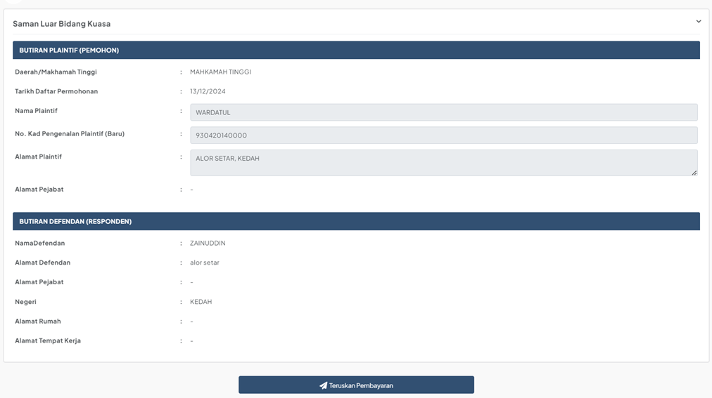
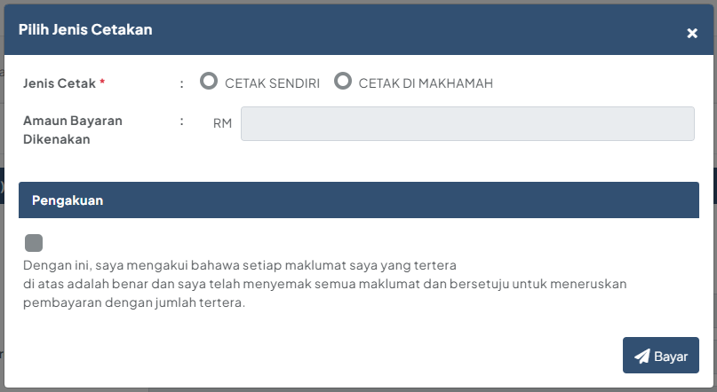
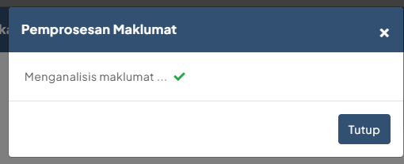
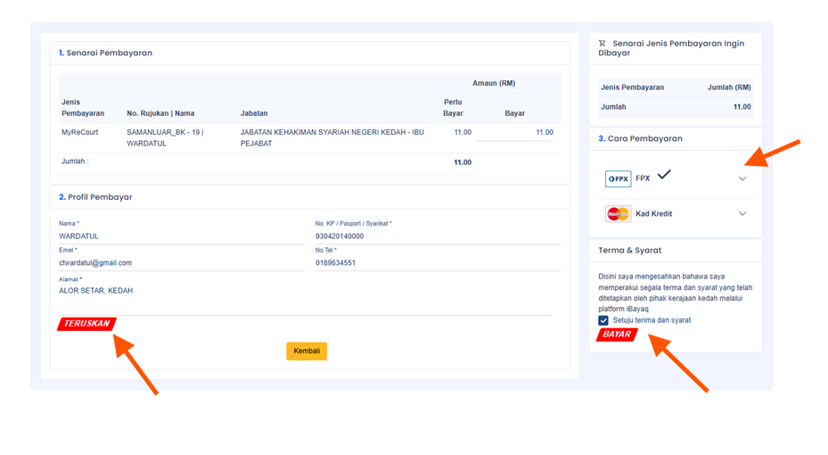
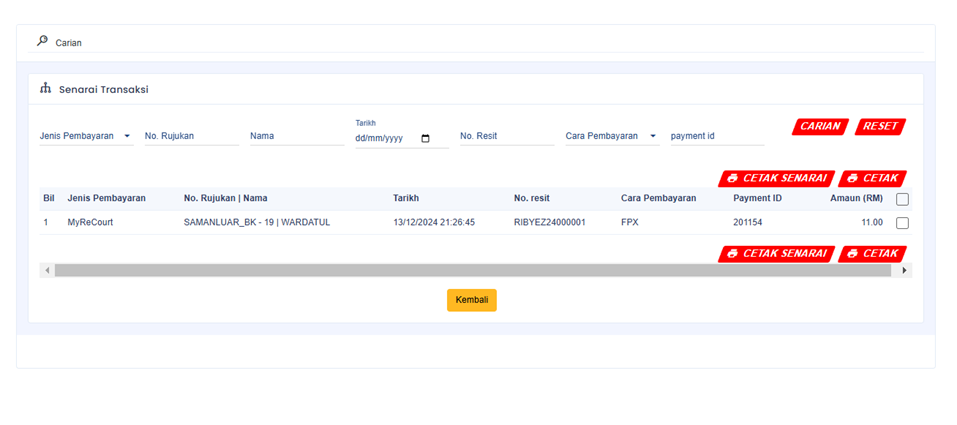
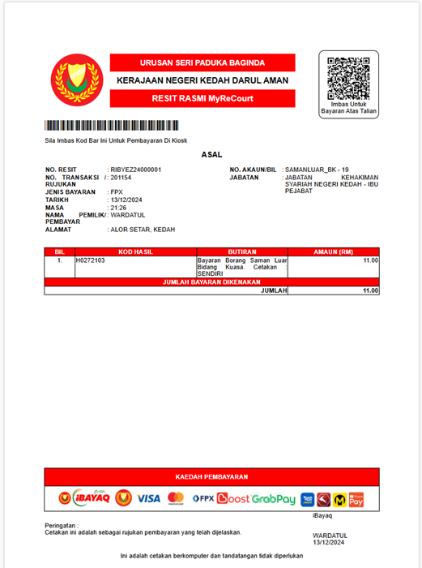
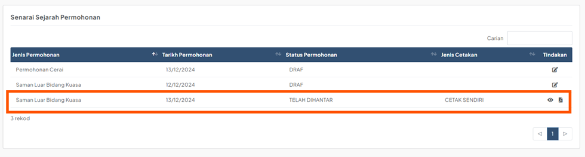

# Panduan Pembayaran

::: info Tujuan
Membantu pengguna untuk membuat pembayaran permohonan dalam sistem MyReCourt.
:::

## Langkah-langkah Pembayaran

### 1. Akses Paparan Pembayaran

::: tip Langkah 1
Terdapat dua cara untuk mengakses paparan pembayaran:
1. Melalui Senarai Permohonan:
   - Klik ikon bayaran pada permohonan berstatus "MENUNGGU PEMBAYARAN"
2. Selepas mengisi borang:
   - Klik butang "Teruskan Pembayaran" selepas mengisi borang permohonan

Sistem akan memaparkan maklumat permohonan berdasarkan jenis borang yang diisi.
:::

### 2. Semak dan Teruskan Pembayaran

::: tip Langkah 2
1. Semak semua maklumat yang dipaparkan
2. Pastikan maklumat adalah tepat
3. Klik butang  untuk meneruskan proses
:::

### 3. Pilih Jenis Cetakan

::: tip Langkah 3
1. Pilih jenis cetakan:
   - **CETAK SENDIRI**: Untuk mencetak sendiri dokumen
   - **CETAK DI MAHKAMAH**: Untuk cetakan di mahkamah
2. Amaun bayaran akan dipaparkan berdasarkan pilihan cetakan
:::

### 4. Pengesahan Pembayaran

::: tip Langkah 4
1. Tandakan kotak Perakuan untuk mengesahkan maklumat
2. Klik butang 
3. Tunggu sehingga pemprosesan maklumat selesai
:::

### 5. Pembayaran iBayaq

::: tip Langkah 5
1. Pada paparan iBayaq:
   - Klik butang "Teruskan"
   - Pilih cara pembayaran (FPX atau Kad Kredit)
   - Tandakan kotak "Setuju terma dan syarat"
   - Klik butang "Bayar"
:::

### 6. Pengesahan Transaksi

::: tip Langkah 6
1. Setelah pembayaran berjaya:
   - Sistem akan memaparkan Senarai Transaksi
   - Klik butang "Cetak" untuk mencetak resit
   - Klik butang "Kembali" untuk ke Senarai Permohonan
:::

### 7. Resit Pembayaran

::: tip Langkah 7
Resit rasmi akan dipaparkan dengan maklumat berikut:
- Nombor resit
- Maklumat pembayar
- Jumlah bayaran
- Tarikh dan masa pembayaran
:::

### 8. Status Permohonan

::: tip Langkah 8
Selepas pembayaran berjaya:
- Status permohonan akan bertukar kepada "TELAH DIHANTAR"
- Ikon cetakan dan papar akan tersedia
:::

::: warning Nota Penting
- Pastikan maklumat pembayaran adalah tepat sebelum meneruskan pembayaran
- Simpan resit pembayaran untuk rujukan
- Pembayaran yang telah dibuat tidak boleh dibatalkan
- Sekiranya menghadapi masalah pembayaran, hubungi pihak mahkamah
::: 