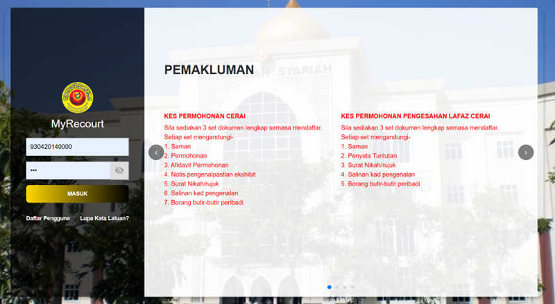
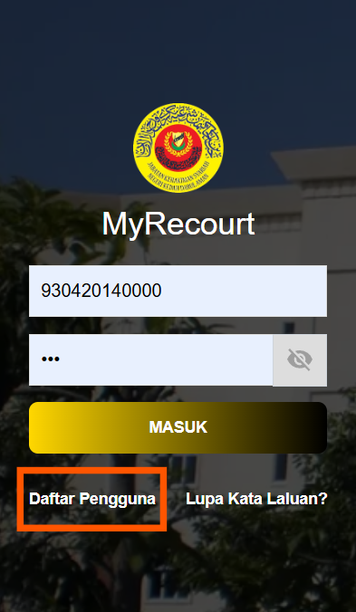
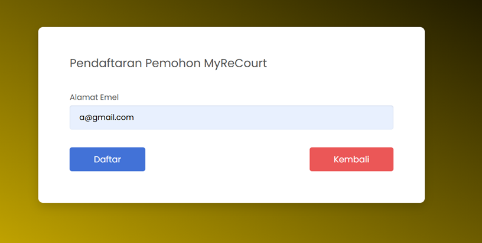
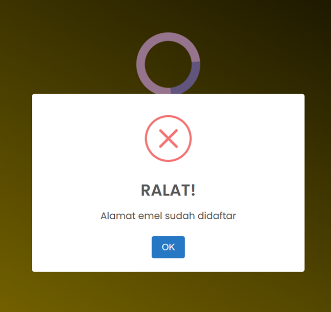
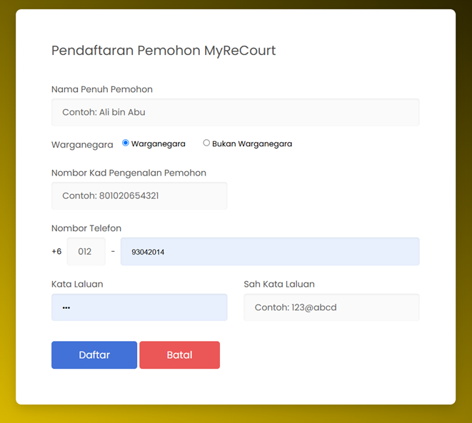
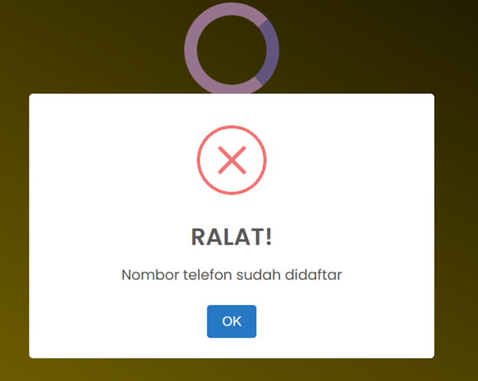
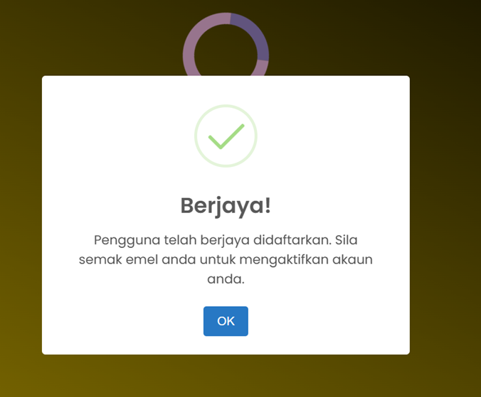

# Panduan Pendaftaran Pengguna

::: info Tujuan
Membantu pengguna untuk mendaftar akaun baru dalam sistem MyReCourt.
:::

## Langkah-langkah Pendaftaran

### 1. Akses Sistem MyReCourt

::: tip Langkah 1
1. Buka pelayar web anda (contohnya Google Chrome)
2. Layari URL: [https://myrecourtv3.datasc.dev/](https://myrecourtv3.datasc.dev/)
3. Anda akan melihat paparan log masuk sistem
:::

### 2. Mulakan Pendaftaran

::: tip Langkah 2
1. Pada paparan log masuk, klik pada pautan **Daftar Pengguna**
2. Sistem akan memaparkan borang pendaftaran
:::

### 3. Semakan Alamat Emel

::: tip Langkah 3
1. Masukkan alamat emel anda
2. Sistem akan menyemak sama ada emel tersebut telah berdaftar
:::

::: warning Perhatian
Sekiranya emel telah berdaftar, sistem akan memaparkan mesej ralat seperti berikut:

:::

### 4. Isi Maklumat Pendaftaran

::: tip Langkah 4
Sekiranya emel belum didaftar, isi maklumat berikut:
1. Nama Penuh Pemohon
2. Pilih status Warganegara/Bukan Warganegara
3. Nombor Kad Pengenalan Pemohon
4. Nombor Telefon
5. Kata Laluan
6. Pengesahan Kata Laluan
:::

::: warning Perhatian
Sekiranya nombor telefon telah berdaftar, sistem akan memaparkan mesej ralat:

:::

### 5. Pengesahan Pendaftaran

::: tip Langkah 5
1. Setelah berjaya mendaftar, sistem akan memaparkan mesej pengesahan
2. Anda akan menerima emel pengaktifan akaun
3. Klik butang **OK** untuk kembali ke paparan log masuk
:::

::: warning Nota Penting
- Pastikan alamat emel yang didaftarkan adalah aktif
- Simpan kata laluan di tempat yang selamat
- Semak emel untuk pengaktifan akaun selepas pendaftaran
:::