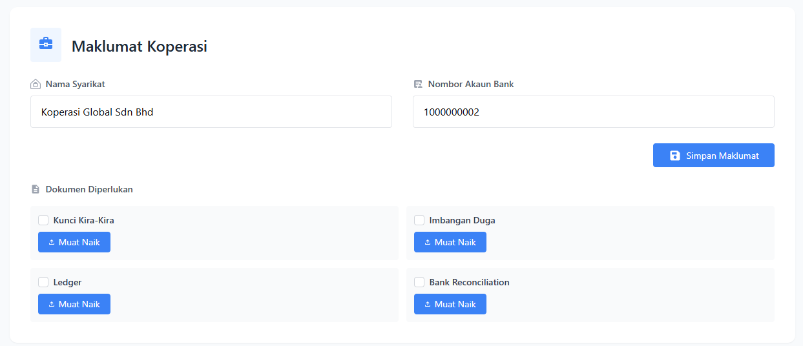
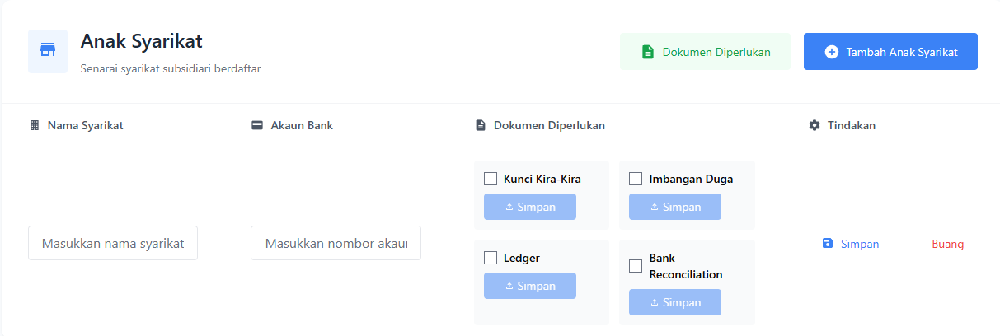

# Pengurusan Entiti

::: info Tujuan
Modul ini membolehkan anda mengurus Koperasi dan syarikat-syarikat subsidiari anda dalam satu platform yang tersusun.
:::

## Maklumat Koperasi

### Cara Mengisi Maklumat Koperasi:

::: tip Langkah-langkah
1. **Nama Syarikat**
   - Cari ruangan input dengan label "Nama Syarikat"
   - Masukkan nama syarikat anda di ruangan yang disediakan
   - Pastikan nama yang dimasukkan adalah nama penuh dan rasmi syarikat

2. **Nombor Akaun Bank**
   - Cari ruangan input dengan label "Nombor Akaun Bank"
   - Masukkan nombor akaun bank yang aktif
   - Pastikan nombor yang dimasukkan adalah tepat untuk mengelakkan masalah pembayaran
:::

## Anak Syarikat

::: info Pengenalan
Bahagian ini membolehkan anda menguruskan senarai syarikat subsidiari yang berdaftar di bawah koperasi anda.
:::

### Jadual Senarai Anak Syarikat

Jadual ini memaparkan maklumat penting setiap anak syarikat:

| Kolum | Keterangan |
|-------|------------|
| Nama Syarikat | Nama rasmi anak syarikat |
| Akaun Bank | Nombor akaun bank anak syarikat |
| Dokumen Diperlukan | Senarai dokumen yang perlu dilampirkan |
| Tindakan | Butang untuk menguruskan maklumat anak syarikat |

### Dokumen Diperlukan

::: info Senarai Dokumen
Berikut adalah senarai dokumen yang perlu dimuat naik:

1. **Kunci Kira-Kira**
   - Klik butang "Muat Naik" untuk memuat naik dokumen

2. **Imbangan Duga**
   - Klik butang "Muat Naik" untuk memuat naik dokumen

3. **Ledger**
   - Klik butang "Muat Naik" untuk memuat naik dokumen

4. **Bank Reconciliation**
   - Klik butang "Muat Naik" untuk memuat naik dokumen
:::

### Menambah Anak Syarikat Baru

::: tip Langkah-langkah
1. Klik butang "Tambah Anak Syarikat" berwarna biru di bahagian kanan atas
2. Semak senarai "Dokumen Diperlukan" dengan mengklik butang yang disediakan
3. Sediakan semua dokumen yang diperlukan dalam format yang betul
4. Isi semua maklumat yang diperlukan dalam borang pendaftaran
:::

::: warning Nota Penting
- Pastikan semua maklumat yang diisi adalah tepat dan terkini
- Simpan salinan dokumen yang telah dimuat naik
- Semua medan yang bertanda (*) adalah wajib diisi
- Butang "Buang" disediakan untuk membuang dokumen yang telah dimuat naik jika perlu
:::

### Status Senarai

::: info Status Kosong
Jika tiada anak syarikat yang berdaftar, sistem akan memaparkan mesej:
"Tiada anak syarikat ditambah lagi. Klik 'Tambah Anak Syarikat' untuk memulakan."
:::
