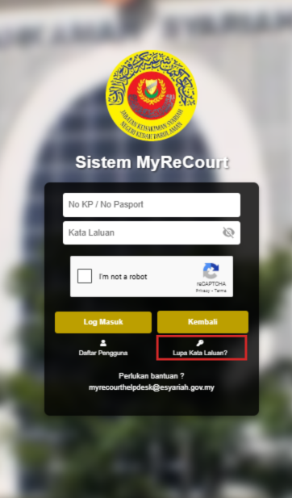
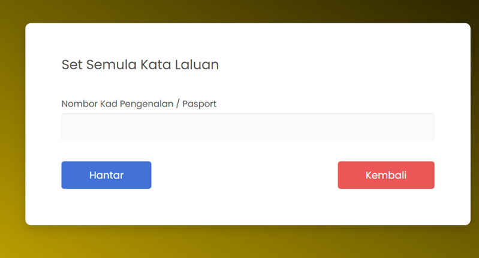
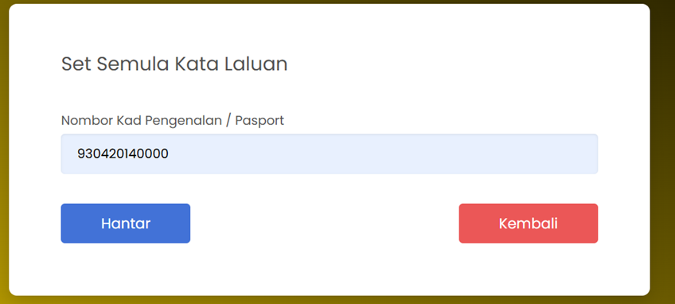
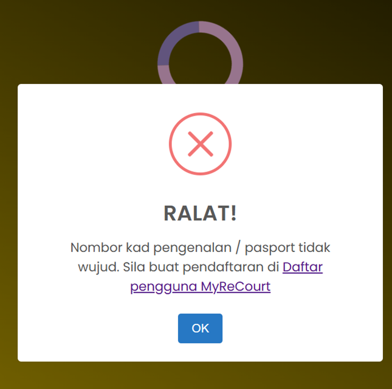
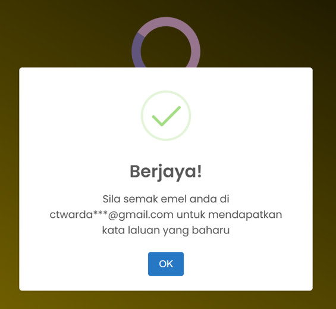
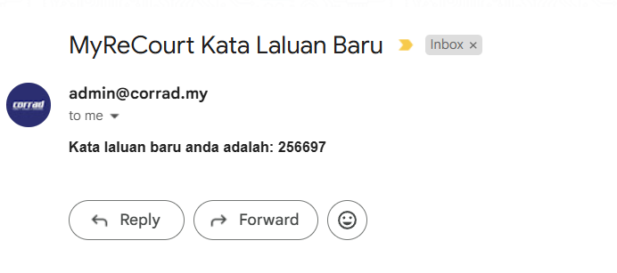

# Panduan Reset Kata Laluan

::: info Tujuan
Membantu pengguna untuk menetapkan semula kata laluan yang terlupa dalam sistem MyReCourt.
:::

## Langkah-langkah Reset Kata Laluan

### 1. Akses Halaman Reset Kata Laluan

::: tip Langkah 1
1. Buka pelayar web anda (contohnya Google Chrome)
2. Layari URL: [https://myrecourtv3.datasc.dev](https://myrecourtv3.datasc.dev)
3. Pada halaman log masuk, klik pada pautan **Terlupa kata laluan?**
:::

### 2. Paparan Set Semula Kata Laluan

::: tip Langkah 2
Sistem akan memaparkan halaman Set Semula Kata Laluan
:::

### 3. Masukkan Maklumat Pengguna

::: tip Langkah 3
Masukkan Nombor Kad Pengenalan / Passport yang telah didaftarkan
:::

### 4. Hantar Permintaan Reset

::: tip Langkah 4
- Klik butang  untuk menghantar emel reset kata laluan
- Klik butang  untuk kembali ke paparan utama
:::

### 5. Pengesahan Status Permintaan

::: warning Perhatian
Sekiranya maklumat yang dimasukkan tidak wujud dalam sistem, paparan ralat akan dipaparkan:
:::

::: tip Kejayaan
Sekiranya maklumat yang dimasukkan adalah betul, sistem akan memaparkan mesej pengesahan:
:::

### 6. Semak Emel

::: tip Langkah 6
1. Semak peti masuk emel anda
2. Anda akan menerima emel yang mengandungi kata laluan yang baru
3. Gunakan kata laluan baru ini untuk log masuk ke dalam sistem
:::

::: warning Nota Penting
- Pastikan anda mempunyai akses kepada emel yang didaftarkan
- Tukar kata laluan yang diterima melalui emel selepas berjaya log masuk
- Sekiranya anda tidak menerima emel dalam peti masuk, sila semak folder SPAM
::: 