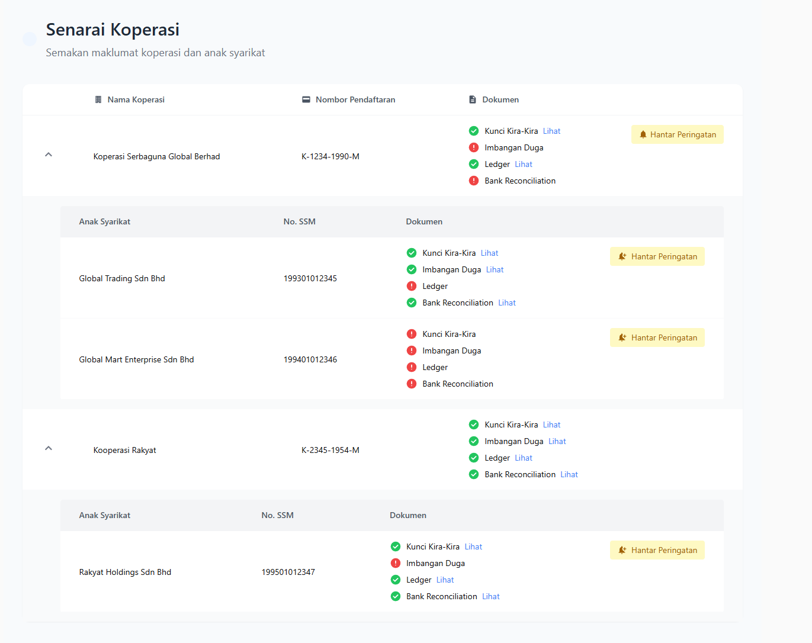
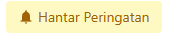

# Panduan Semakan Pengesahan Audit

## Pengenalan
Manual ini menerangkan proses semakan pengesahan audit untuk dokumen-dokumen yang dimuat naik oleh koperasi dan anak syarikat. Juruaudit bertanggungjawab untuk menyemak kelengkapan dokumen dan menghantar peringatan jika dokumen tidak lengkap.

## Jenis-jenis Dokumen untuk Semakan
1. Kunci Kira-Kira
2. Imbangan Duga
3. Ledger
4. Bank Reconciliation

### Proses Semakan
1. Klik pada pautan "Lihat" di sebelah setiap jenis dokumen untuk menyemak dokumen yang telah dimuat naik oleh koperasi atau anak syarikat
2. Status dokumen ditunjukkan dengan ikon:
   - 🟢 Hijau: Dokumen lengkap dan sah
   - 🟥 Merah: Dokumen tidak lengkap atau tidak sah

### Menghantar Peringatan
1. Jika terdapat dokumen yang tidak lengkap, klik butang "Hantar Peringatan"

2. Sistem akan menghantar notifikasi kepada koperasi atau anak syarikat berkenaan
3. Peringatan akan direkodkan dalam sistem

## Amalan Terbaik
1. Semak dokumen secara berkala
2. Hantar peringatan dengan segera jika dokumen tidak lengkap
3. Pastikan semua dokumen disemak mengikut garis panduan audit
4. Rekod semua tindakan semakan dalam sistem
