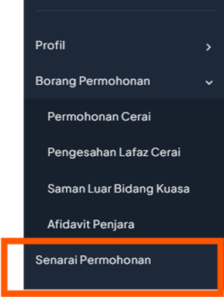
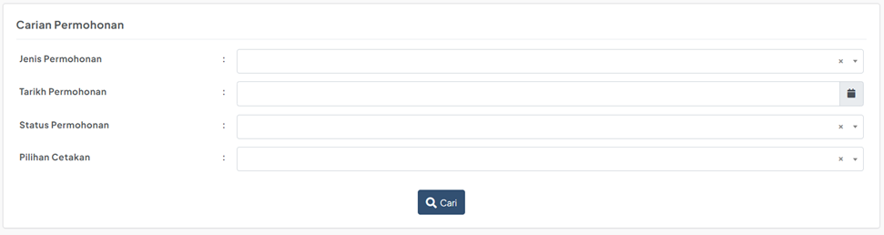
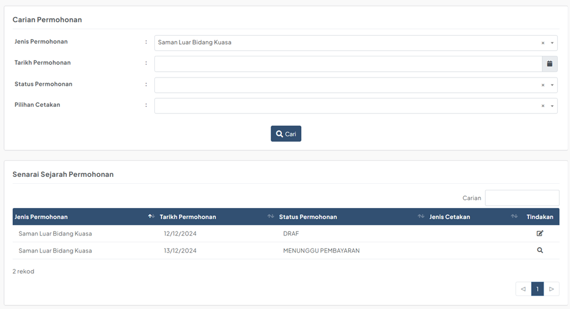

# Panduan Senarai Permohonan

::: info Tujuan
Membantu pengguna untuk menyemak sejarah permohonan dan membuat tindakan berdasarkan status permohonan semasa dalam sistem MyReCourt.
:::

## Langkah-langkah Penggunaan

### 1. Akses Senarai Permohonan

::: tip Langkah 1
1. Log masuk ke dalam sistem MyReCourt
2. Klik pada menu **Senarai Permohonan**
3. Sistem akan memaparkan senarai semua permohonan yang pernah dibuat
:::

### 2. Carian Permohonan

::: tip Langkah 2
Anda boleh membuat carian menggunakan beberapa kriteria:
- Jenis Permohonan
- Tarikh Permohonan
- Status Permohonan
- Pilihan Cetakan
:::

### 3. Paparan Senarai

::: tip Langkah 3
Sistem akan memaparkan senarai permohonan berdasarkan kriteria carian yang dipilih
:::

### 4. Ikon Tindakan

::: tip Langkah 4
Setiap permohonan mempunyai ikon tindakan yang berbeza bergantung kepada status permohonan:

#### a) Ikon Papar 
- Untuk melihat maklumat terperinci permohonan
- Tidak boleh mengemaskini maklumat
- Muncul untuk status:
  - DIHANTAR
  - PERMOHONAN SELESAI
  - DIKEMASKINI OLEH ADMIN

#### b) Ikon Edit 
- Untuk melihat dan mengemaskini maklumat permohonan
- Muncul untuk status:
  - DRAF

#### c) Ikon Cetak PDF 
- Untuk mencetak borang permohonan dalam format PDF
- Muncul untuk permohonan yang:
  - Telah berjaya dihantar
  - Jenis Cetakan: CETAK SENDIRI

#### d) Ikon Bayaran 
- Untuk membuat pembayaran permohonan
- Navigasi ke paparan pembayaran
- Muncul untuk status:
  - MENUNGGU PEMBAYARAN
:::

::: warning Nota Penting
- Permohonan berstatus DRAF boleh dikemaskini pada bila-bila masa
- Permohonan yang telah dihantar tidak boleh dikemaskini
- Pastikan pembayaran dibuat untuk permohonan yang berstatus MENUNGGU PEMBAYARAN
- Simpan salinan PDF permohonan yang telah dihantar untuk rujukan
::: 